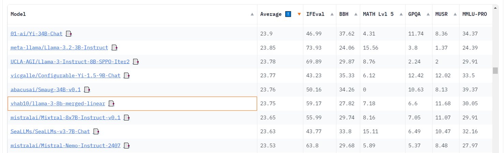

# Model Merging with MergeKit

## Overview
This repository provides a streamlined approach to merging pre-trained models using **MergeKit** and deploying them to the Hugging Face Hub. 

---

## Merged Models

### [Llama-3.2-Instruct-3B-TIES](https://huggingface.co/vhab10/Llama-3.2-Instruct-3B-TIES)  
This model is created by merging three Llama-3.2-3B models using the **TIES merging method**. It integrates a general-purpose base model with two instruction-tuned models, resulting in a robust language model capable of performing a wide range of tasks effectively.

### [llama-3-8b-merged-linear](https://huggingface.co/vhab10/llama-3-8b-merged-linear)  
This model is a **linear merge** of three Llama 3-8B models. By leveraging the strengths of each base model, including multilingual capabilities and domain-specific knowledge, it produces a highly versatile and generalized language model.

---

## Leaderboard Performance

Below is a screenshot showcasing the leaderboard performance of the `llama-3-8b-merged-linear` model:  

---

## How to Create Your Own Merged Model

If you want to create a merged model, follow the step-by-step instructions provided in the [Colab Notebook](./llama_model_merging.ipynb) included in this repository. The notebook guides you through:  
- Installing dependencies  
- Configuring the merge process  
- Performing inference on the merged model  
- Pushing the model to Hugging Face  

Visit the [MergeKit Repository](https://github.com/arcee-ai/mergekit) for additional details and tools.

---

## Resources
- [Llama-3.2-Instruct-3B-TIES on Hugging Face](https://huggingface.co/vhab10/Llama-3.2-Instruct-3B-TIES)  
- [llama-3-8b-merged-linear on Hugging Face](https://huggingface.co/vhab10/llama-3-8b-merged-linear)  
- [MergeKit Repository](https://github.com/arcee-ai/mergekit)  

---

